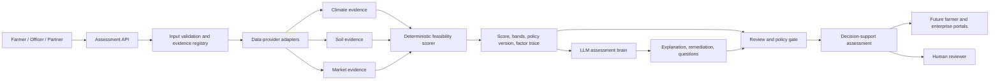

# AgriScore — Baseline Implementation Architecture

**Status:** Proposed implementation baseline, v0.1  
**Author:** Manus AI  
**Date:** 18 August 2026

## 1. Architectural decision

The supplied design establishes a strong product vision: a multi-agent system that connects agronomic feasibility, climate risk, market demand, and downstream finance. The implementation baseline will preserve that vision while separating **evidence collection**, **deterministic risk calculation**, **LLM-led reasoning and explanation**, and **human financial decisioning**.

> **The LLM is the evidence-aware reasoning and communication layer. It is not permitted to change the calculated score, assign a loan price, approve or deny credit, or execute commercial transactions.**

This boundary resolves a central design problem. Crop feasibility requires contextual interpretation, uncertainty communication, question generation, and farmer-facing advice—tasks for which a language model is appropriate. However, financial decisions require reproducible, auditable, policy-governed calculations and lender review. A deterministic engine provides that repeatability, while the LLM transforms its documented outputs into intelligible assessment explanations and remediation plans. This supports trustworthy AI practices while preserving the option to improve statistical models after outcome data becomes available.[1]

## 2. Target system design



| Layer | Responsibility | Baseline components | Design rule |
|---|---|---|---|
| Evidence layer | Validate, normalize, timestamp, and attribute soil, climate, and market evidence | Typed request schemas, provider adapters, local fixtures | Every datapoint carries source, timestamp, units, and quality metadata. |
| Decisioning layer | Calculate three component scores and a composite score | Versioned policy file, scoring engine, evidence completeness engine | All calculations are deterministic, tested, and replayable. |
| Agentic reasoning layer | Explain assessment, highlight uncertainty, formulate remediation and follow-up questions | Prompt template, strict JSON schema, OpenAI-compatible LLM adapter | The LLM receives only de-identified assessment evidence and cannot modify score or policy. |
| Control layer | Apply risk gates and maintain an audit record | Review status, missing-evidence flags, policy/prompt/model identifiers | No automated credit approval, pricing, denial, insurance quote, ordering, or matching. |
| Experience layer | Present assessment and gather data | REST API now; future farmer, officer, buyer, and admin interfaces | API-first so mobile/chat/dashboard channels can evolve independently. |

## 3. Scoring approach for the pilot

The original 35% agronomic, 30% climate, and 35% market weighting is retained as a **versioned pilot policy**. Each component will be scored 0–100 from transparent factor scores, then combined as follows:

\[
\text{FeasibilityScore} = 0.35A + 0.30C + 0.35M
\]

The initial policy accepts normalized factor values only after input validation. It supports a conservative evidence-quality gate: a high numerical score does not become decision-ready when essential evidence is missing, stale, or below the configured quality threshold. This avoids encoding false precision from sparse data.

| Component | Initial factors | Output | Intended future calibration |
|---|---|---|---|
| Agronomic suitability (A) | Crop-profile compatibility, pH fit, N/P/K adequacy, drainage | Score plus factor trace | Regional extension-agency guidance and observed yields |
| Climate/environmental risk (C) | Precipitation fit, drought risk, storm risk, planting-window timing | Score plus factor trace | Weather history, plot geography, planting and harvest outcomes |
| Market/economic demand (M) | Demand index, price trend, import-substitution priority | Score plus factor trace | Verified wholesale/off-taker prices, fulfilment data, contracts |

The tiers from the source document will be represented as **feasibility bands** only in the first release. They are explicitly not loan grades or approvals. A human reviewer must supply and approve any jurisdiction-specific lending policy, then validate the model against historical outcomes before downstream financial use. Model-risk guidance emphasizes documentation, validation, outcome analysis, monitoring, and an effective independent challenge function.[2]

## 4. LLM assessment brain

The baseline will use a selectable, OpenAI-compatible model via environment configuration. The proposed default is **`gpt-5`** for its structured reasoning capability, with **`gpt-5-mini`** available for lower-cost development/test workloads. The implementation will not hardcode API keys or rely on a fixed model catalog.

The LLM call uses a strict JSON schema and receives a compact `AssessmentEvidencePacket` containing the deterministic score, factor trace, evidence quality, missing fields, crop profile, and safe user context. It returns only the following non-authoritative objects:

| LLM output | Function | Constraint |
|---|---|---|
| Executive summary | Plain-language synopsis of the score and evidence | Must identify uncertainty and avoid credit promises. |
| Positive drivers | Explains strongest evidence-backed factors | Must cite factor keys from the provided trace. |
| Risk drivers | Explains lower-scoring factors and their impact | Must never invent data or alter values. |
| Remediation actions | Prioritized agronomic/data-collection actions | Framed as decision-support, not professional agronomic instruction. |
| Clarifying questions | Requests missing, stale, or contradictory evidence | Does not request sensitive attributes unrelated to feasibility. |
| Confidence statement | Qualitative confidence tied to evidence completeness | Cannot claim statistical probability. |

The system prompt prohibits the model from creating credit decisions, APRs, insurance prices, contracts, guarantees, or ungrounded claims. It rejects text that contradicts the immutable score/evidence packet. If the LLM is unavailable or invalid, the system returns a deterministic explanation and retains the score. This gives a useful service failure mode without turning an LLM outage into a decisioning outage.

## 5. Data-integration strategy

The project will start with provider-neutral interfaces and deterministic fixtures, rather than prematurely embedding unverified external feeds. NASA POWER is a suitable candidate for a climate adapter because its official API provides analysis-ready data products and documents predictable HTTP error semantics.[3] SoilGrids must not be a single-point production dependency: ISRIC currently reports that its REST API is paused, beta, and lacks an uptime guarantee.[4] Operational market scoring should be based on validated local prices and off-taker records; broader public sources are a future benchmark, not a substitute for local liquidity data.

| Domain | Baseline source | Production direction | Required provenance |
|---|---|---|---|
| Soil | User/lab supplied soil observation | Accredited soil testing partners, national soil inventory, regional baselines | Sample date, source, method, units, location precision |
| Climate | Request payload and deterministic fixture | NASA POWER historical/climate data plus locally approved weather/forecast source | Provider, retrieval date, grid/location, time range, quality flags |
| Market | Versioned local fixture | Off-taker demand feed, wholesale price collection, optional public benchmark feed | Source, observation date, market/location, commodity specification, collection method |
| Crop profile | Pilot JSON profile | Regionally validated crop requirement profiles under expert governance | Owner, version, effective date, citations, calibration notes |

No provider credentials are embedded in source control. Provider calls will use a circuit-breaker-compatible boundary with caching, timeouts, retries, response validation, and a safe fallback to `review_required`.

## 6. Credit and responsible-AI guardrails

The previous financial-risk matrix is retained in the documentation as a future business-policy artifact only. It will not be implemented as automatic underwriting. This is a product and governance boundary, not a claim about the law of any particular jurisdiction. Before a lender uses the system for actual credit actions, counsel and qualified risk/compliance owners must define the relevant regulations, permissible data, notices, validation methods, human-override process, and incident response. As an example of the general explanation principle, U.S. CFPB guidance says that creditors using AI must provide specific and accurate reasons for adverse actions, not opaque category labels.[5]

| Risk | Baseline control |
|---|---|
| Opaque score | Return component and factor-level contribution trace with policy version and input provenance. |
| Sparse or stale evidence | Compute `evidence_quality`; route to `REVIEW_REQUIRED` rather than mark decision-ready. |
| LLM hallucination | Strict response schema, immutable deterministic record, contradiction checks, and deterministic fallback. |
| Prompt injection in user text | Do not pass free-text untrusted instructions into system context; delimit it as untrusted data and apply output checks. |
| Sensitive or unlawful data use | Request the minimum data required for agronomic feasibility; exclude protected/sensitive personal characteristics from baseline request schemas. |
| Model drift | Maintain a model/prompt/policy inventory and add outcome monitoring once real yield/default data is lawfully available. |
| Unapproved policy change | Version and hash the scoring policy; peer review policy changes and keep a decision replay record. |

## 7. Initial repository scope

The initial repository will contain a runnable Python API and tests implementing a complete, safe vertical slice. It will not claim production-ready agronomic recommendations or credit underwriting.

```text
agriscore-agentic-platform/
├── app/
│   ├── api/                 # FastAPI routes and dependency wiring
│   ├── domain/              # Typed request/result contracts
│   ├── scoring/             # Deterministic policy, factors, tiers, evidence gate
│   ├── agents/              # LLM assessment brain and deterministic fallback
│   ├── integrations/        # Provider contracts and future climate/market adapters
│   └── observability/       # Audit-event models and redaction helpers
├── config/                  # Versioned pilot policy and crop-profile fixtures
├── docs/                    # Architecture, governance, data contracts, roadmap
├── tests/                   # Unit, API, policy and agent-fallback tests
├── pyproject.toml
├── README.md
└── .env.example
```

## 8. Phased roadmap

| Release | Objective | Completion evidence |
|---|---|---|
| Baseline (this build) | Assessment API, deterministic 35/30/35 scoring, evidence gate, LLM explanation adapter, test suite, documents | Sample request returns traceable `REVIEW_REQUIRED` decision support without external dependencies |
| Pilot data readiness | Curated crop profiles, data-provider adapters, farmer/plot data model, approval workflow | Controlled pilot with registered data sources, quality monitoring, and subject-matter-expert review |
| Field pilot | Farmer/officer mobile/chat experience, evidence upload, audit dashboard, outcome capture | Time-bounded pilot with calibrated operational metrics and documented limitations |
| Financial integration readiness | Separate lender policy service, validation, fairness/impact review, adverse-reason templates, governance approval | Only after lender sign-off, legal review, historical outcomes, and independent validation |

## References

[1]: https://www.nist.gov/itl/ai-risk-management-framework "NIST AI Risk Management Framework"
[2]: https://www.federalreserve.gov/frrs/guidance/supervisory-guidance-on-model-risk-management.htm "Federal Reserve: Supervisory Guidance on Model Risk Management"
[3]: https://power.larc.nasa.gov/docs/services/api/ "NASA POWER API Documentation"
[4]: https://isric.org/explore/soilgrids "ISRIC SoilGrids service status"
[5]: https://www.consumerfinance.gov/archive/newsroom/cfpb-issues-guidance-on-credit-denials-by-lenders-using-artificial-intelligence/ "CFPB guidance on credit denials using AI"
