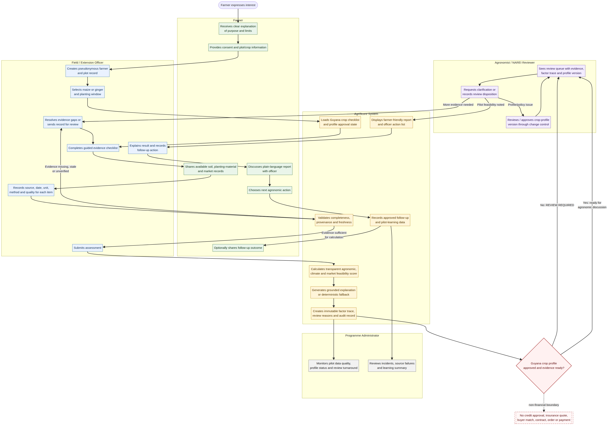
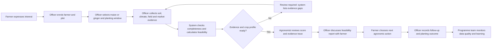

# AgriScore Guyana Pilot — End-to-End User Journey

**Status:** Future MVP experience blueprint; the frontend is not yet built.  
**Pilot scope:** Guyana, maize and ginger, pre-plant feasibility decision support.  
**Core principle:** The software helps assemble and explain evidence; qualified people remain accountable for agronomic review and every downstream decision.

## 1. Experience in one view

The intended experience is **officer-led at first**. A farmer may use their own phone in later releases, but early pilot assessments should be completed with a trained officer to ensure that plot, soil, climate, and market records are correctly collected and consented.

## 2. People and their experience

| User | Primary goal | What they see and do | What they cannot do |
|---|---|---|---|
| Farmer | Understand whether the planned maize or ginger crop is feasible, what evidence is missing, and what should be verified next | Gives consent; describes the plot and intended crop; provides available records; reviews a plain-language result with the officer; chooses whether to collect more evidence or seek advice | Cannot receive a loan decision, insurance quote, contract, buyer match, or guaranteed planting recommendation from the system |
| Field / extension officer | Create complete, trustworthy assessments and support the farmer | Enrols participant; records plot/crop plan; captures evidence; submits assessment; resolves flagged gaps; explains the report; records follow-up | Cannot override evidence quality silently or activate an unapproved crop profile |
| Agronomist / NAREI reviewer | Validate crop logic and review field-specific evidence | Approves/rejects profile versions; reviews queue; examines factor trace and source dates; requests clarification; records review disposition and rationale | Cannot make financial/commercial decisions through the system |
| Programme administrator | Operate the pilot safely and measure value | Manages roles, partner configuration, audit/data-quality dashboards, training status, and incident/change records | Cannot change policy/profile content without proper approval workflow |
| Data / AI operator | Keep technical services reliable and safe | Monitors connector failures, missing evidence, model fallback rates, policy/model versions, and system errors | Cannot access more personal/plot data than their role permits or alter approved decisions without an audit trail |

## 3. Detailed farmer-and-officer journey

The following story illustrates a typical future MVP interaction. The farmer and plot are fictional examples.

### Stage 1 — Interest and supported onboarding

A farmer, **Ms. K**, is considering planting ginger. She visits an extension activity or is referred by a pilot partner. The officer explains what AgriScore does and does not do: it helps organise soil, climate, crop, and market evidence before planting; it does not decide whether Ms. K receives finance or guarantee that a crop will succeed.

The officer opens the **Pilot Enrolment** screen, explains the consent statement, and records a pseudonymous farmer reference rather than unnecessary identity data. The officer creates a plot record with the approximate location, size, intended planting period, and current land-use context. Ms. K can see what information is being collected and why.

| User touchpoint | Screen / interaction | System action | User outcome |
|---|---|---|---|
| Introduction | Officer-led explainer or short farmer leaflet | Shows plain-language purpose and limitations | Informed choice to participate |
| Consent | Consent confirmation | Stores consent reference and permitted data scope | Data collection is authorised for the pilot |
| Plot registration | Farmer/plot form | Creates `assessment_reference` and plot record | A specific plot can be assessed without exposing unnecessary personal data |
| Crop intention | Crop selection | Offers **maize** or **ginger** only | The correct evidence checklist is activated |

### Stage 2 — Crop and planting-plan selection

Ms. K chooses **ginger**, indicates the likely planting window, and describes whether she plans to sell fresh ginger, process it, or serve a known buyer. The system loads the ginger evidence checklist. It clearly labels the ginger profile as **pending local agronomic approval** during the early pilot stage, so neither the officer nor farmer mistakes a preliminary score for a planting clearance.

The farmer sees a short checklist in plain language: soil test, drainage/standing-water observation, source and health of planting material, climate context, and a dated market/buyer observation. The officer sees the detailed version with required units, source types, and evidence-quality controls.

### Stage 3 — Evidence collection

The officer records or uploads evidence over one or more visits. If a laboratory result is not yet available, the system does not invent a value. It records the soil task as pending and keeps the assessment in `REVIEW_REQUIRED`.

For a maize assessment, evidence includes soil and drainage conditions, intended maize form/use, planting timing, climate context, and a dated demand/price observation. For ginger, the workflow adds planting-material provenance and plant-health checks because those records materially affect assessment readiness.

| Evidence step | Farmer experience | Officer experience | System behaviour |
|---|---|---|---|
| Soil evidence | Shares available report or agrees to sampling | Records sample/report date, laboratory/method, units, and values | Marks missing, stale, ambiguous, or unverified records for review |
| Plot/drainage check | Walks plot with officer where feasible | Completes structured observation and consented photo/reference | Retains the source and date; no unsupported inference |
| Climate context | Confirms local timing/conditions observed | Retrieves or attaches approved climate evidence | Captures provider, location/time window, retrieval time, and quality flags |
| Market evidence | Describes intended product and buyer/market knowledge | Records dated price/demand observation with crop form, unit, market and source | Prevents market score when commodity form or provenance is absent |
| Ginger planting material | Shows source/records if available | Captures source, health/inspection status, and relevant notes | Keeps ginger review-required until required evidence is present and profile is approved |

### Stage 4 — Assessment submission and immediate feedback

When the officer selects **Generate assessment**, the system validates the record before calculating the feasibility score. It calculates agronomic, climate, and market components transparently from the approved policy. It also calculates evidence quality separately.

The system then produces a simple status, such as **“More evidence is required before review”** or **“Ready for agronomic review.”** It does not show a false green light simply because some numerical inputs are favourable. The LLM explanation turns the immutable factor trace into short, grounded language, while a deterministic fallback is used if the LLM is unavailable.

> Example: “The preliminary ginger assessment has a moderate feasibility score, but it requires review because the crop profile is not yet locally approved and the soil evidence has not been verified. The next priority is to obtain the soil report and document the source and health status of planting material.”

### Stage 5 — Agronomic review

The assessment enters the **Review Queue**. The agronomist sees the crop, plot reference, planned planting period, overall score, component scores, evidence quality, profile version, all review reasons, and links to source evidence. They can request clarification, record that evidence is insufficient, or issue a pilot review disposition.

The reviewer does not simply see an AI paragraph. They see the factor-level trace that created the score, including source, date, quality, and contribution. Any reviewer action is recorded with a timestamp, role, rationale, and policy/profile version.

| Reviewer disposition | Meaning to officer and farmer | System follow-up |
|---|---|---|
| `MORE_EVIDENCE_NEEDED` | The assessment is incomplete or evidence is not reliable enough | Creates targeted evidence tasks and retains `REVIEW_REQUIRED` |
| `AGRonomic_DISCUSSION_REQUIRED` | Evidence exists but needs contextual professional interpretation | Schedules/displays a review discussion; no automatic planting instruction |
| `PILOT_FEASIBILITY_NOTED` | The assessment is sufficiently evidenced for the controlled pilot record | Produces a traceable feasibility report; still not a loan/insurance/commercial decision |
| `PROFILE_OR_POLICY_ISSUE` | The evaluation exposed a problem with the underlying crop profile or policy | Opens change-control review; does not retroactively erase prior results |

### Stage 6 — Farmer discussion and action plan

The officer meets or calls Ms. K to explain the result in plain language. The report is designed to answer four questions:

1. **What evidence supports the assessment?**
2. **What factors helped or constrained feasibility?**
3. **What information is missing or uncertain?**
4. **What should be verified or discussed with a qualified agricultural professional next?**

The farmer may decide to obtain a soil test, improve drainage, change planting timing, seek advice on planting material, or defer a decision. The system records the chosen follow-up action as a pilot observation; it does not force a farmer to act or make commercial commitments.

### Stage 7 — Follow-up and outcome learning

After the planting window or another defined checkpoint, the officer records whether the farmer proceeded, what evidence was added, and—where consented—basic outcomes such as planting completion, crop health observations, harvest result, or market outcome. These observations are not used to silently retrain or recalibrate the system. They first enter an evaluation dataset for agronomic and technical review.

## 4. Administrator and programme journey

The administrator begins each pilot cycle by confirming that the active country is Guyana, the only active pilot crops are maize and ginger, the appropriate user roles are assigned, and the currently active crop profiles are approved. In the current codebase, both Guyana crop profiles remain intentionally pending approval.

During the pilot, the administrator uses a **Pilot Operations Dashboard** to see assessment completion rates, missing-evidence patterns, source/provider failures, review turnaround, LLM fallback rate, policy/profile changes, and incident reports. The dashboard does not expose unnecessary farmer identity data by default.

At the end of the cycle, the programme team exports a de-identified pilot readout: number of assessments by crop/location, evidence completion, review outcomes, common constraints, actions taken, agronomist feedback, and the limitations requiring changes before scale-up.

## 5. MVP screens to build

| Priority | Screen / feature | Primary user | Why it is needed now |
|---:|---|---|---|
| P0 | Sign-in and role-aware landing page | All operational users | Establishes secure, understandable entry to the pilot |
| P0 | Officer dashboard | Officer | Shows assigned assessments, drafts, evidence tasks, and review feedback |
| P0 | Farmer/plot enrolment | Officer with farmer | Captures consent and creates the crop–plot–window assessment unit |
| P0 | Maize/ginger evidence checklist | Officer | Guides data capture and prevents omitted required fields |
| P0 | Evidence record view | Officer and reviewer | Shows raw value, source, date, unit, quality, and verification state |
| P0 | Assessment result view | Officer and reviewer | Shows score, status, factor trace, review reasons, safe explanation, and disclaimer |
| P0 | Agronomist review queue | Agronomist | Enables requests for evidence and recorded pilot dispositions |
| P1 | Farmer-friendly report / print view | Farmer with officer | Makes assessment understandable without requiring digital fluency |
| P1 | Admin pilot dashboard | Administrator | Supports operations, data quality, and governance oversight |
| P1 | Follow-up/outcome capture | Officer | Creates a reviewed learning loop after planting |
| P2 | Farmer self-service and chat | Farmer | Should follow evidence-workflow validation, not precede it |
| P2 | Voice and multilingual support | Farmer | Valuable for accessibility, but needs tested content and consent design |

## 6. Experience guardrails visible to users

The interface should make the following rules visible rather than burying them in legal text:

| Moment | Required message |
|---|---|
| Enrolment | “This tool helps prepare a crop-feasibility assessment. It does not approve finance, insurance, or contracts.” |
| Missing evidence | “The assessment needs more verified information before a qualified reviewer can evaluate it.” |
| Preliminary result | “This is a feasibility decision-support result, not a guarantee of yield, income, market access, or financing.” |
| Ginger profile pending | “The ginger profile is being reviewed by local agricultural experts; the result requires human review.” |
| Review complete | “The reviewer’s comments support crop planning. Discuss field-specific actions with the appropriate agricultural professional.” |
| Follow-up | “Outcome information is optional and supports pilot learning; it will be used only according to the agreed consent and data-governance process.” |

## 7. What the current software can and cannot demonstrate

The current repository can demonstrate the backend portion of this journey: structured assessment input, deterministic scoring, evidence quality/staleness controls, review-required reasons, LLM explanation with fallback, and the Guyana maize/ginger profile gate. It does **not** yet contain the enrolment, evidence-entry, reviewer, dashboard, or report screens described above.

The next frontend build should prioritise the P0 officer and reviewer workflow. This is the shortest path to a usable, safe pilot: it turns the existing backend capabilities into an operational field process while maintaining human accountability and avoiding premature financial automation.
